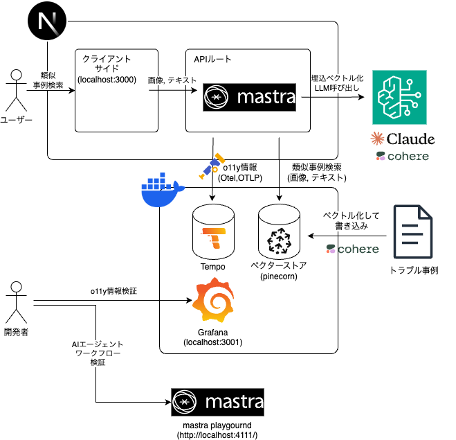

# nextjs-mastra-manufacturing

## Architecture




## Quick Start
```bash
npm install
```

```bash
docker compose up -d
```

initialize pinecone vector store
```bash
# requires assuming AWS role
npx tsx ./bin/init-vector-store.ts
```

lunch app
```bash
# requires assuming AWS role
npm run dev
```

lunch mastra playground
```bash
# requires assuming AWS role
npx mastra dev
```
